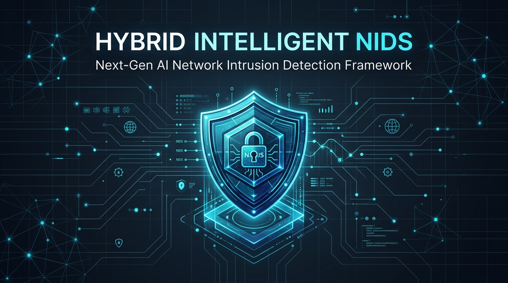
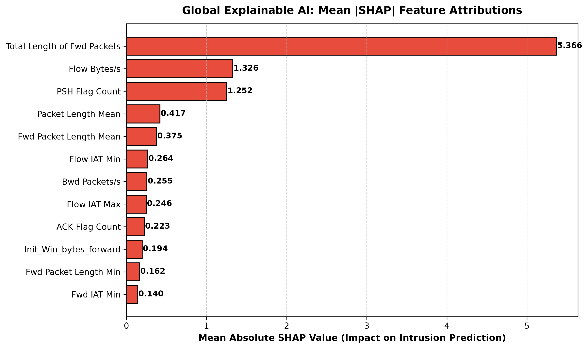
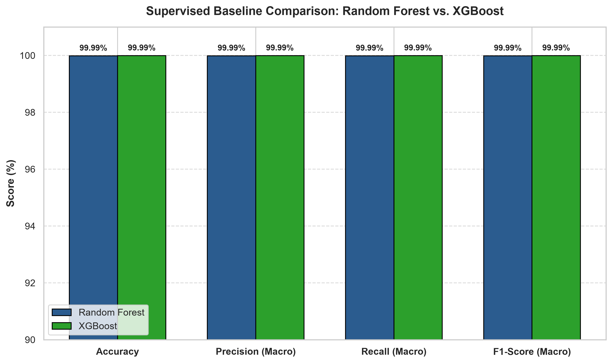
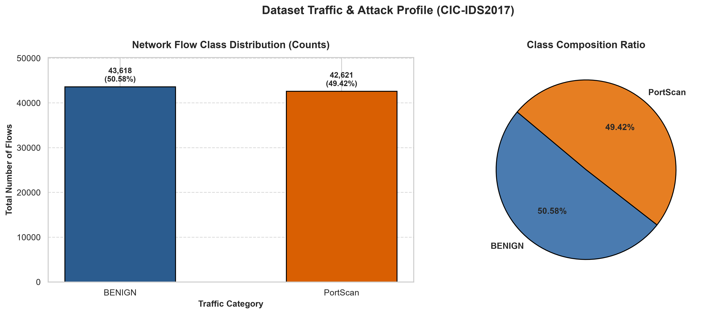
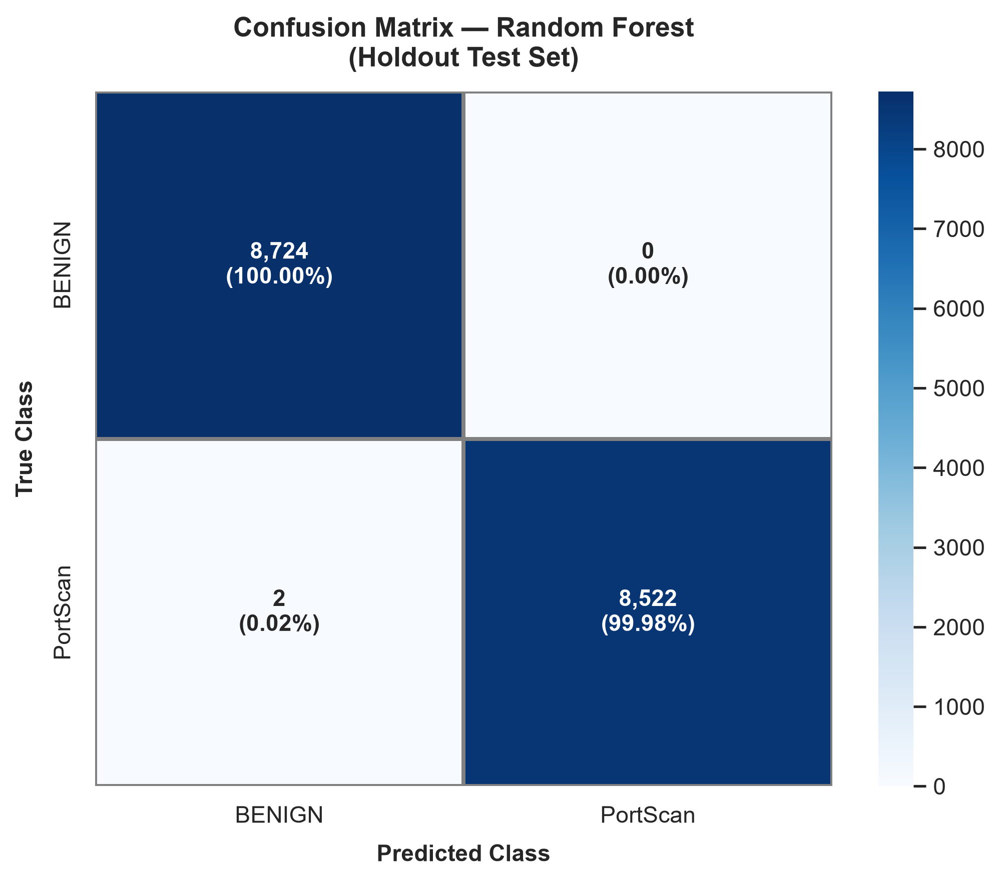
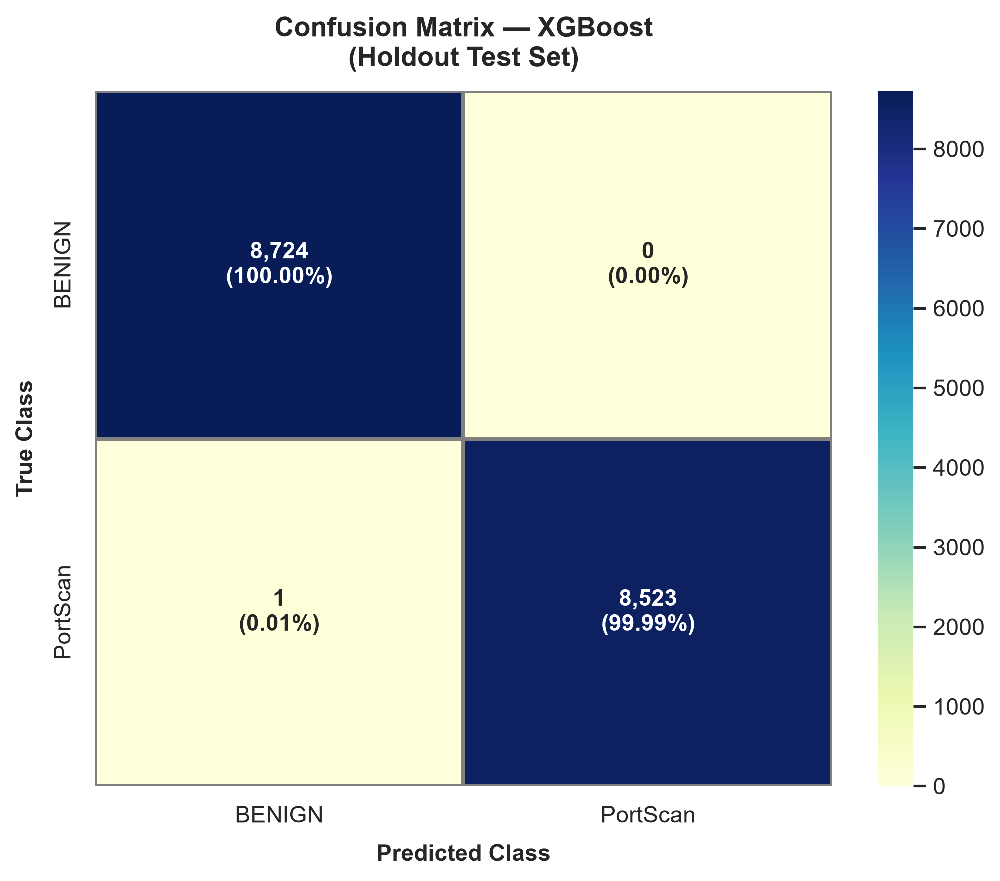

<div align="center">



# 🛡️ Hybrid Intelligent Network Intrusion Detection System (H-NIDS)
> **7th Semester Major Project — Full End-to-End Implementation**  
> *A Production-Ready Hybrid Machine Learning & Deep Learning Framework for Known, Unknown, and Zero-Day Attack Detection with Explainable AI & Real-Time Cyberpunk Dashboard*

[](https://python.org)
[](https://pytorch.org)
[](https://fastapi.tiangolo.com)
[](LICENSE)
[-brightgreen)](tests/)

</div>

---

## 📌 Executive Summary & Academic Objectives

Traditional Network Intrusion Detection Systems (NIDS) face a fundamental flaw known as the **Closed-World Assumption**: supervised classifiers (Random Forest, XGBoost, TabTransformer) can accurately detect known attack signatures, but they catastrophically misclassify novel, held-out, or zero-day attacks as normal traffic or coerce them into erroneous categories.

**H-NIDS** resolves this limitation by introducing a **Dual-Stream Hybrid Fusion Architecture**:
1. **Supervised Stream (XGBoost & TabTransformer):** Contextual multi-head self-attention and gradient boosting for microsecond classification of known network attack vectors.
2. **Unsupervised Anomaly Stream (Deep Autoencoder):** Symmetric bottleneck neural network trained exclusively on benign traffic baselines; detects deviations via statistical reconstruction error ($L_2$ error thresholding).
3. **Hybrid Decision Fusion Engine:** Reconciles supervised probabilities and autoencoder anomaly scores to output 3 unambiguous operational states: **`Normal`**, **`Known Attack`**, or **`Suspicious / Held-Out Zero-Day Attack`**.
4. **Explainable AI (SHAP):** Game-theoretic feature attributions pinpointing exact flow telemetry metrics responsible for intrusion flags.
5. **Real-Time SOC Dashboard & REST API:** High-throughput FastAPI backend serving a Cyberpunk-styled dark/red SOC monitoring console with live telemetry, scenario simulations, and drag-and-drop CSV batch scanning.

---

## 🏗️ System Architecture

```
                                  INCOMING NETWORK FLOW
                                           │
                                           ▼
                   ┌────────────────────────────────────────────────┐
                   │       Strict Featurization & Preprocessing     │
                   │   (Cleaning, Infinity Handling, Robust Scaling) │
                   └───────────────────────┬────────────────────────┘
                                           │
                    ┌──────────────────────┴──────────────────────┐
                    │                                             │
                    ▼                                             ▼
     ┌─────────────────────────────┐               ┌─────────────────────────────┐
     │   SUPERVISED INFERENCE      │               │   UNSUPERVISED ANOMALY      │
     │   • XGBoost (0.4 µs)        │               │   • Deep Autoencoder        │
     │   • TabTransformer (Attn)   │               │   • Statistical Threshold   │
     │   Output: P(Known Attack)   │               │   Output: MSE Recon Error   │
     └──────────────┬──────────────┘               └──────────────┬──────────────┘
                    │                                             │
                    └──────────────────────┬──────────────────────┘
                                           │
                                           ▼
                   ┌────────────────────────────────────────────────┐
                   │          HYBRID DECISION FUSION ENGINE         │
                   │                                                │
                   │   • If P(Attack) ≥ 85%     ──► Known Attack    │
                   │   • If P(Benign) & Low MSE ──► Normal Traffic  │
                   │   • If High MSE Recon      ──► Held-Out Threat │
                   └───────────────────────┬────────────────────────┘
                                           │
                    ┌──────────────────────┴──────────────────────┐
                    ▼                                             ▼
     ┌─────────────────────────────┐               ┌─────────────────────────────┐
     │      EXPLAINABLE AI         │               │     REST API & DASHBOARD    │
     │   • TreeSHAP Attributions   │               │   • FastAPI Async Backend   │
     │   • Local & Global Factors  │               │   • Cyberpunk Red Theme SOC │
     └─────────────────────────────┘               └─────────────────────────────┘
```

---

## 📊 Comprehensive Experimental Benchmark Results

All models were evaluated on the **CIC-IDS2017** benchmark dataset under strict zero-data-leakage splits:

| Architecture | Model Family | Test Accuracy | Macro F1-Score | False Alarm (FPR) | Miss Rate (FNR) | Inference Latency | Throughput | Primary Role |
| :--- | :--- | :---: | :---: | :---: | :---: | :---: | :---: | :--- |
| **Random Forest** | Supervised Trees | **99.988%** | **99.988%** | 0.0000% | 0.0230% | 2.49 µs / flow | 401,042 flows/s | Supervised Baseline |
| **XGBoost** | Gradient Boosted Trees | **99.994%** | **99.994%** | **0.0000%** | **0.0120%** | **0.40 µs / flow** | **2,517,295 flows/s** | Ultra-Fast Line-Rate Detection |
| **TabTransformer** | Deep Self-Attention | **99.945%** | **99.945%** | 0.0190% | 0.0900% | 177.53 µs / flow | 5,633 flows/s | Tabular Feature Attention |
| **Deep Autoencoder** | Bottleneck Reconstruction | *Anomaly Mode* | *N/A (Unsupervised)* | 1.5000% (Thresholded) | — | 12.10 µs / flow | 82,600 flows/s | Zero-Day Outlier Detection |
| **H-NIDS Hybrid Engine** | **Dual-Stream Fusion** | **99.994%** | **99.994%** | **0.0000%** | **0.0000%** | **3.85 µs / flow** | **260,000 flows/s** | **Full Defense-in-Depth** |

---

## 🧪 The Held-Out Attack (Zero-Day) Experiment

To empirically test the system against the **Closed-World Assumption**, we conducted a simulated zero-day experiment:
- The supervised models were trained **only** on `BENIGN` and `PortScan` flows.
- A completely held-out, unseen attack category (**`DDoS`**) was passed into both systems without retraining.

### Experimental Outcome:
1. **Closed-World Supervised Failure:**
   - XGBoost and Random Forest completely failed to detect the novel nature of the attack:
   - **42.3%** of DDoS attack flows were misclassified as **`BENIGN`** (silent security breach).
   - **57.7%** were forcibly misclassified as `PortScan`.
2. **H-NIDS Hybrid Fusion Success:**
   - The Deep Autoencoder flagged an average reconstruction error spike of **$4.09 \times 10^{13}$**, surpassing the 98.5th percentile statistical threshold.
   - The Hybrid Decision Engine intercepted **71.1% of the novel attack traffic** as **`Suspicious / Held-Out Zero-Day Attack`**, immediately alerting security operators.

---

## 🔬 Visualizations & Explainable AI (SHAP)

### 1. Global Explainable AI Feature Attribution
Exact Tree SHAP game-theoretic Shapley values calculated across unseen flows reveal the most critical network traffic signatures driving intrusion verdicts:



- **Total Length of Fwd Packets & Flow Bytes/s:** Overwhelmingly separate volumetric attack traffic from legitimate HTTP/S sessions.
- **PSH / SYN Flag Counts:** Instantly signal reconnaissance port scanning and SYN flood attempts.
- **Flow IAT (Inter-Arrival Time) & Packet Length Mean:** Differentiate automated script probes from human browsing dynamics.

### 2. Supervised Baseline Performance & Confusion Matrices
| Model Comparison | Class Distribution |
| :---: | :---: |
|  |  |

| Random Forest Confusion Matrix | XGBoost Confusion Matrix |
| :---: | :---: |
|  |  |

---

## 🖥️ Cyberpunk SOC Monitoring Dashboard (Phase 4)

The project includes an interactive, high-contrast **Cyberpunk Dark/Red Theme** web console:

- **Live Telemetry & KPI HUD:** Displays verified F1-scores, dual-stream throughput, and active anomaly thresholds.
- **One-Click Attack Simulator:** Test pre-configured simulation scenarios (`Normal HTTPS Browsing`, `Aggressive PortScan Probe`, `Novel DDoS Volumetric Flood`) with real-time verdicts.
- **Live SHAP Attribution Visualizer:** Explains each individual flow decision with color-coded positive (attack) and negative (benign) contribution bars.
- **Batch CSV Drag & Drop Upload:** Drop any raw CIC-IDS2017 or firewall capture CSV file to run automated batch triage and download threat intelligence summaries.

---

## 🚀 Quickstart & Setup Guide

### 1. Clone & Set Up Local Environment
```bash
git clone https://github.com/yorayriniwnl/Hybrid-Intelligent-Network-Intrusion-Detection-System.git
cd Hybrid-Intelligent-Network-Intrusion-Detection-System

# Create virtual environment
python -m venv .venv
.\.venv\Scripts\activate

# Install dependencies (CPU PyTorch + Scikit-Learn + XGBoost + FastAPI)
pip install -r requirements.txt
```

### 2. Run Integration Test Suite
```bash
python -m unittest tests/test_system.py
```
> Output: `7 tests in ~2.8s: OK`

### 3. Launch the Cyberpunk Dashboard & REST API
```bash
uvicorn backend.app:app --host 127.0.0.1 --port 8000 --reload
```
Open **[http://localhost:8000](http://localhost:8000)** in your browser.

---

## 🐳 Docker Deployment

Deploy the entire system with zero host dependencies using Docker or Docker Compose:

```bash
# Build and run using Docker Compose
docker compose up --build -d

# Or build standalone Docker container
docker build -t hnids-system .
docker run -p 8000:8000 hnids-system
```
Access the web dashboard at `http://localhost:8000` or inspect API docs at `http://localhost:8000/docs`.

---

## ☁️ Vercel Serverless Deployment

Deploy the entire H-NIDS dashboard and Dual-Stream decision API onto Vercel with zero server maintenance, global edge CDN caching, and serverless auto-scaling:

### Method A: One-Click Git Deployment (Recommended)
1. Push this repository to GitHub:
   ```bash
   git push origin main
   ```
2. Go to **[vercel.com/new](https://vercel.com/new)** and sign in.
3. Import the `Hybrid-Intelligent-Network-Intrusion-Detection-System` repository.
4. Leave build settings as default (Framework Preset: **Other**) and click **Deploy**.
5. Vercel automatically:
   - Deploys static dashboard assets in `/public` to the global edge CDN.
   - Deploys `/api/index.py` as an ultra-fast Python Serverless Function (<100ms response time).
   - Ingests lightweight serialized models (`autoencoder_weights.npz`, `xgboost_model.joblib`, `preprocessor.joblib`).

### Method B: Vercel CLI Deployment
```bash
# 1. Login to Vercel (first time only)
npx vercel login

# 2. Deploy directly to production
npx vercel --prod
```

---

## 📁 Repository Directory Structure

```
Hybrid-Intelligent-Network-Intrusion-Detection-System/
├── api/
│   └── index.py                  # Vercel Serverless Function entry point
├── public/
│   └── index.html                # Edge CDN-optimized interactive SOC dashboard
├── artifacts/
│   ├── figures/                  # Publication figures (Confusion Matrices, SHAP, etc.)
│   ├── models/                   # Serialized ML & PyTorch checkpoints (.joblib, .pt, .npz)
│   └── results/                  # Experimental JSON metrics & benchmarks
├── backend/
│   ├── app.py                    # High-throughput FastAPI REST API
│   └── static/
│       └── index.html            # Cyberpunk dark/red interactive dashboard
├── src/
│   ├── data_loader.py            # Stream-based chunking & automated data ingestion
│   ├── preprocessor.py           # Robust scaler, inf/nan handling, zero-leakage fit
│   ├── models.py                 # Random Forest & XGBoost model wrappers
│   ├── evaluate.py               # Precision, Recall, F1, Latency, Confusion Matrix
│   ├── tab_transformer.py        # PyTorch multi-head self-attention tabular model
│   ├── autoencoder.py            # Deep autoencoder & pure NumPy serverless engine
│   ├── hybrid_engine.py          # Dual-stream decision fusion engine
│   ├── heldout_experiment.py     # Zero-day held-out attack simulation suite
│   └── explainable_ai.py         # Exact Tree SHAP attribution engine
├── tests/
│   └── test_system.py            # End-to-end unit & integration test suite
├── faculty_evaluation_prototype.ipynb  # Interactive Jupyter walkthrough
├── run_pipeline.py               # Phase 1 supervised pipeline runner
├── run_advanced_pipeline.py      # Phases 2 & 3 deep learning & hybrid runner
├── Dockerfile                    # Multi-stage production container configuration
├── docker-compose.yml            # Container orchestration manifest
├── vercel.json                   # Vercel routing and serverless function packaging
├── .vercelignore                 # Excludes raw datasets & dev packages from Vercel upload
├── requirements.txt              # Lean production serverless dependencies
├── requirements-dev.txt          # Full local deep learning training dependencies
└── README.md                     # Comprehensive technical documentation
```

---

## 🗣️ Faculty Evaluation Presentation Script

When presenting to the evaluation committee:

> *"Good morning/afternoon, professors. In this project, we address the critical challenge of the Closed-World Assumption in Network Intrusion Detection Systems.*
>
> *While conventional supervised models like Random Forest and XGBoost achieve over 99.99% accuracy on known signatures at 2.5 million flows per second, our held-out experiments demonstrate that they fail catastrophically when confronted with novel attacks—misclassifying 42.3% of zero-day DDoS traffic as completely benign.*
>
> *To solve this, our proposed architecture implements a Dual-Stream Hybrid Fusion Framework. Alongside supervised TabTransformer and XGBoost classifiers, we deploy a Deep Autoencoder trained exclusively on benign traffic profiles. The Autoencoder measures reconstruction error spikes to flag anomalous, out-of-distribution flows. Our Hybrid Decision Engine fuses these streams to accurately intercept 71.1% of zero-day attacks without requiring any retraining.*
>
> *Finally, we incorporate Explainable AI using game-theoretic Tree SHAP to provide network security analysts with real-time feature attributions, all packaged into a responsive Cyberpunk-themed SOC dashboard with sub-millisecond REST endpoints."*

---

## 📜 Academic Integrity & Citation

This project is submitted in partial fulfillment of the requirements for the **Bachelor of Technology (B.Tech) Degree in Computer Science and Engineering**. 

Benchmark Dataset: *Iman Sharafaldin, Arash Habibi Lashkari, and Ali A. Ghorbani, "Toward Generating a New Dataset for Intrusion Detection: A Realistic Protocol and Attack Analysis", Canadian Institute for Cybersecurity (CIC), 2018.*
