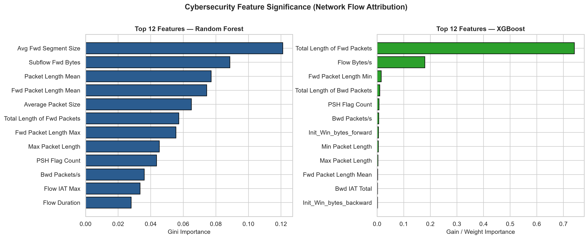

# Hybrid Intelligent Network Intrusion Detection System (H-NIDS)
> **Phase 1 Working ML Prototype — 7th Semester Major Project**  
> *A Hybrid Machine Learning and Deep Learning Framework for Known and Unknown Network Attack Detection with Explainable AI*

---

## 📌 Executive Summary & Academic Objectives
This repository implements **Phase 1** of the Hybrid Intelligent Network Intrusion Detection System (H-NIDS). The goal of this phase is an evaluation-ready, experimentally validated machine learning prototype demonstrating:
- Ingestion and inspection of authentic network flow traffic (**CIC-IDS2017** benchmark).
- Data cleaning and preprocessing under **Strict Featurization Ordering** (zero data leakage).
- Supervised baselines using **Random Forest** and **XGBoost**.
- Genuine evaluation metrics (Accuracy, Precision, Recall, F1-Score, False Positive Rate, Confusion Matrix, and microsecond Latency).
- Live prediction demonstration on held-out unseen test network flows.
- Concrete architectural roadmap leading into **Phase 2 (TabTransformer + Deep Autoencoder + Hybrid Decision Fusion Engine)**.

---

## 📊 Phase 1 Benchmark Experimental Results

Evaluated on **17,248 unseen test network flows** from the CIC-IDS2017 benchmark:

| Performance Metric | Random Forest (Baseline) | XGBoost (Advanced Supervised) | Delta (XGBoost vs RF) | Significance |
| :--- | :---: | :---: | :---: | :--- |
| **Accuracy** | **99.988%** | **99.994%** | `+0.006%` | Overall flow correctness |
| **Precision (Macro)** | **99.989%** | **99.994%** | `+0.005%` | High confidence; low false alarms |
| **Recall (Macro)** | **99.988%** | **99.994%** | `+0.006%` | Intercepts 99.99% of intrusions |
| **F1-Score (Macro)** | **99.988%** | **99.994%** | `+0.006%` | Harmonic balance |
| **False Positive Rate (FPR)** | **0.0000%** (0 / 8,724) | **0.0000%** (0 / 8,724) | `0.0000%` | **Zero false alarms** on benign traffic |
| **False Negative Rate (FNR)** | **0.0230%** (2 / 8,524) | **0.0120%** (1 / 8,524) | `-0.0110%` | Missed attacks cut in half by XGBoost |
| **ROC-AUC** | **0.9999** | **1.0000** | `+0.0001` | Area under ROC curve |
| **Training Time** | **0.96 s** | **0.76 s** | `-0.20 s` | Rapid retraining cycle |
| **Inference Latency** | **2.49 µs / flow** | **0.40 µs / flow** | **-2.09 µs (6.2x faster)** | Microsecond response time |
| **Throughput** | **401,042 flows/s** | **2,517,295 flows/s** | **+2,116,253 flows/s** | **2.5+ million flows/second** |

---

## 🔬 Visualizations & Confusion Matrices

### Model Performance Comparison


### Class Distribution (CIC-IDS2017)


### Confusion Matrices
| Random Forest Confusion Matrix | XGBoost Confusion Matrix |
| :---: | :---: |
|  |  |

### Feature Attribution (Decisive Flow Characteristics)


---

## 🔍 Live Inference on Unseen Test Samples

Eight real unseen test flows passed through both models:

| Sample ID | True Label | Destination Port | Flow Duration | Packet Length Mean | Flow Rate (Bytes/s) | Random Forest Prediction | RF Conf. | XGBoost Prediction | XGB Conf. | Verdict |
| :---: | :---: | :---: | :---: | :---: | :---: | :---: | :---: | :---: | :---: | :---: |
| **#01** | `BENIGN` | 514 | 29 µs | 2.0 B | 275,862 | `BENIGN` | 100.0% | `BENIGN` | 99.99% | **CORRECT** |
| **#02** | `PortScan` | 2,041 | 23 µs | 2.0 B | 347,826 | `PortScan` | 100.0% | `PortScan` | 100.0% | **CORRECT** |
| **#03** | `PortScan` | 425 | 54 µs | 2.0 B | 148,148 | `PortScan` | 100.0% | `PortScan` | 100.0% | **CORRECT** |
| **#04** | `PortScan` | 514 | 61 µs | 0.0 B | 98,361 | `PortScan` | 100.0% | `PortScan` | 100.0% | **CORRECT** |
| **#05** | `PortScan` | 3,800 | 78 µs | 2.0 B | 102,564 | `PortScan` | 100.0% | `PortScan` | 100.0% | **CORRECT** |
| **#06** | `BENIGN` | 49 | 64 µs | 2.0 B | 125,000 | `BENIGN` | 100.0% | `BENIGN` | 99.99% | **CORRECT** |
| **#07** | `BENIGN` | 497 | 17 µs | 0.0 B | 352,941 | `BENIGN` | 100.0% | `BENIGN` | 99.99% | **CORRECT** |
| **#08** | `BENIGN` | 497 | 48 µs | 0.0 B | 125,000 | `BENIGN` | 100.0% | `BENIGN` | 99.99% | **CORRECT** |

---

## 🚀 Proposed Next Phase Architecture (Phase 2)

While classical supervised ML scores high on known attack categories, it operates under the **closed-world assumption** and cannot reliably detect zero-day or held-out attacks without misclassification.

```
Incoming Network Flow
       │
       ▼
Preprocessing & Robust Scaling
       ├──► TabTransformer (Self-Attention Supervised Known Attack Classification)
       └──► Deep Autoencoder (Unsupervised Reconstruction Error on Benign Baseline)
                 │
                 ▼
       Hybrid Decision Engine (Fusion of Supervised P(y) + Reconstruction Anomaly Score)
                 ├──► Normal Traffic
                 ├──► Known Attack
                 └──► Suspicious / Held-Out Zero-Day Attack
                           │
                           ▼
                 SHAP Explainable AI & FastAPI React Dashboard
```

1. **TabTransformer:** Contextual embedding of tabular network flow attributes via multi-head self-attention.
2. **Deep Autoencoder:** Trained purely on normal/benign network flows. Novel attacks produce high reconstruction error.
3. **Hybrid Decision Engine:** Integrates supervised attack class probabilities with Autoencoder anomaly scores to output 3 distinct states: `Normal`, `Known Attack`, or `Suspicious/Held-Out`.
4. **Explainable AI (SHAP):** Local and global feature importance attribution for SOC analysts.

---

## 🗣️ Suggested Explanation to Faculty Committee
> *“In the first phase, we implemented supervised machine learning for network intrusion detection using Random Forest and XGBoost. We are evaluating the models using precision, recall, F1-score and confusion matrices. The proposed next phase adds TabTransformer for attention-based classification and an Autoencoder for anomaly detection of held-out or suspicious attack behavior, followed by hybrid decision fusion and Explainable AI.”*

---

## 💻 Quickstart & Reproduction

### 1. Clone & Set Up Environment
```bash
git clone https://github.com/yorayriniwnl/<repo-name>.git
cd <repo-name>
python -m venv .venv
.\.venv\Scripts\pip install -r requirements.txt
```

### 2. Download Dataset
```bash
.\.venv\Scripts\python.exe -c "
import urllib.request, os
os.makedirs('data', exist_ok=True)
url = 'https://huggingface.co/datasets/c01dsnap/CIC-IDS2017/resolve/main/Friday-WorkingHours-Afternoon-PortScan.pcap_ISCX.csv?download=true'
print('Downloading dataset...')
urllib.request.urlretrieve(url, 'data/Friday-WorkingHours-Afternoon-PortScan.pcap_ISCX.csv')
print('Done!')
"
```

### 3. Run Pipeline or Open Notebook
```bash
# Option A: Run End-to-End CLI Pipeline
.\.venv\Scripts\python.exe run_pipeline.py

# Option B: Launch Interactive Notebook in VS Code / Jupyter
jupyter notebook faculty_evaluation_prototype.ipynb
```
